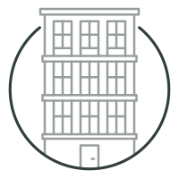
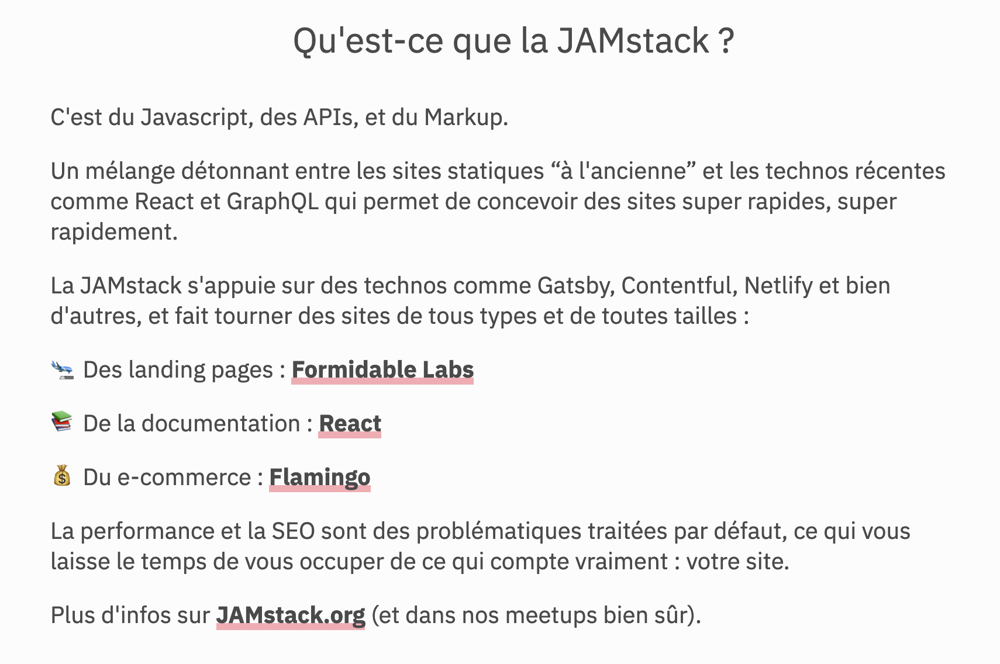
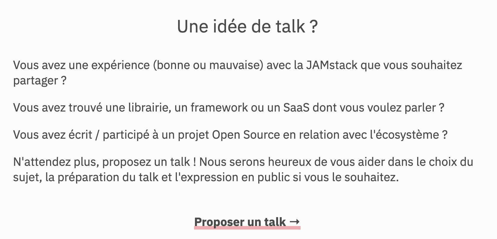

<p align="center">
    
</p>
<h1 align="center">
  Gatsby Theme Meetup
</h1>

<h3 align="center">
  ⚛️ :handshake: :coffee:
</h3>
<h3 align="center">
  Launch your meetup website in minutes :rocket:
</h3>
<p align="center">
  Gatsby Theme Meetup is an open source theme based on Gatsby that helps meetup organizers create blazing fast meetup sites to share to their community.
</p>
<p align="center">
  <a href="https://github.com/gatsbyjs/gatsby/blob/master/LICENSE">
    
  </a>
  <a href="https://www.npmjs.org/package/@matthieuauger/gatsby-theme-meetup">
    
  </a>
  
  <a href="https://twitter.com/intent/follow?screen_name=jamstackparis">
    
  </a>
</p>

<h3 align="center">
  <a href="https://jamstack.paris/">Demo</a>
  <span> · </span>
  <a href="#rocket-get-your-meetup-site-up-and-running-in-5-minutes">Quickstart</a>
  <span> · </span>
  <a href="https://gatsbyjs.org/docs/">Learn Gatsby</a>
  <span> · </span>
  <a href="https://www.gatsbyjs.org/docs/themes/what-are-gatsby-themes/">About Themes</a>
  <span> · </span>
</h3>

Gatsby Theme Meetup is a simple theme for meetup organizers. Theme features includes

- **Past and futures meetup** fetched from [Meetup](https://www.meetup.com) thanks to [https://github.com/phacks/gatsby-source-meetup](gatsby-source-meetup)

- **Configurable** meetup name, CFP form, videos link and editorial content powered by markdown

- **Translatable texts** for call to action

## :rocket: Get Your Meetup Site Up and Running in 5 Minutes

You can get a new Meetup Gatsby site up and running on your local dev environment in 5 minutes with these four steps:

1. **Create you meetup site directory and bootstrap package.json.**

   ```shell
   mkdir my-awesome-meetup-website
   cd my-awesome-meetup-website/
   npm init -y
   ```

2. **Install Gatsby, Gatsby Theme Meetup and its dependencies.**

   ```sh
   npm install react react-dom gatsby @matthieuauger/gatsby-theme-meetup
   ```

3. **Configure Gatsby to use the Gatsby Theme Meetup**

   Open the `my-awesome-meetup-website` directory in your code editor of choice, create a `gatsby-config.js` file at the root with following lines and save your changes

   ```javascript
   module.exports = {
     plugins: [
       {
         resolve: "@matthieuauger/gatsby-theme-meetup"
       }
     ]
   };
   ```

4. **Start the site in `develop` mode.**

   ```sh
   node_modules/.bin/gatsby develop # or install Gatsby CLI globally with npm install -g gatsby-cli
   ```

At this point, you’ve got a fully functional Meetup website. For now, it fetchs and dislpay content for the JAMstack Paris Meetup.

## :paintbrush: Configure site for your meetup

The theme offers simple configurations directly by modifying the `gatsby-config.js` file in your site directory.

:point_up: **Beware, when updating your gatsby-config.js file, you must stop and start again `gatsby develop` so it can source the new configuration** :point_up:

- **Meetup Name** (_default: JAMstack Paris_)
- **Homepage Headline** (_default: Le meetup bimestriel autour de la JAMstack_)
- **Meetup.com group URL**. You can get it in [the URL of your Meetup](https://www.meetup.com/fr-FR/JAMstack-paris/) (_default: jamstack-paris_)
- **Videos Url** (_by default, redirect to the [JAMstack Paris Youtube Page](https://www.youtube.com/channel/UC66eQOycjMnaqzpbRUhEK2w)_)
- **Talk Proposal Url** (_by default, redirect to the [JAMstack Paris form](https://docs.google.com/forms/d/e/1FAIpQLScYo0W4QAkRHLj0fS_TXZXFuSUJ_cRlmyJCeRTPDQVt9RBNog/viewform)_)

Here is an example of a `gatsby-config.js` configuration for the JAMstack London Meetup.

```javascript
module.exports = {
  plugins: [
    {
      resolve: "@matthieuauger/gatsby-theme-meetup",
      options: {
        meetupName: "JAMstack London",
        meetupHomepageHeadline: "The JAMstack meetup with a cup of tea 🍵",
        meetupDotComGroupUrlName: "JAMstack-London",
        displayVideosLink: false,
        //meetupVideosUrl = 'https://www.youtube.com/channel/UC66eQOycjMnaqzpbRUhEK2w'
        talkProposalUrl: "#",
        //textBlocksPath: `${__dirname}/src/text-blocks`,
        translations: {
          PROPOSE_A_TALK: "Propose a talk →",
          FETCH_VIDEOS: "See videos →",
          LAST_MEETUPS: "Last meetups",
          REGISTER_ON_MEETUP: "Register on Meetup →"
        }
      }
    }
  ]
};
```

:point_up: **Beware, when updating your gatsby-config.js file, you must stop and start again `gatsby develop` so it can source the new configuration** :point_up:

## :writing_hand: Personalize Editorial Content

Editorial content consists of three blocks on the website.

1. The main text at the top of the page (usually a description of your Meetup but can be whatever)
   

2. The main text at the bottom of the page (usually a call to action for talk proposals)
   

3. The footer (usually some credits or sponsorship links)
   

These contents are [markdown files](/packages/%40matthieuauger/gatsby-theme-meetup/src/text-blocks) sourced by Gatsby during build time.

To override these:

1. **Create the text-blocks directory in your site which will contain your markdown editorial content.**

   ```shell
   mkdir -p src/text-blocks
   ```

2. **Copy the [Markdown files](/packages/%40matthieuauger/gatsby-theme-meetup/src/text-blocks) inside your site directory.**

   ```shell
   cp node_modules/@matthieuauger/gatsby-theme-meetup/src/text-blocks/*.md src/text-blocks
   ```

3. **Add option in the configuration to tell Gatsby to source content from your directory**

   <!-- prettier-ignore -->
   ```javascript
   module.exports = {
     plugins: [
       {
         resolve: "@matthieuauger/gatsby-theme-meetup",
         options: {
           //
           // ... your configuration here
           //
           textBlocksPath: `${__dirname}/src/text-blocks`,
           //
           // ... you configuration here
           //
         }
       }
     ]
   };
   ```

4. **Edit the copied markdown files in your code editor. Beware not to change the _type_ field at the top of the markdown files.**

:point_up: **Beware, when updating your gatsby-config.js file, you must stop and start again `gatsby develop` so it can source the new configuration** :point_up:

## :lipstick: Change Logo

Look at the [Advanced configuration](-advanced-configuration) section.

## :ghost: Advanced configuration

For more advanced configurations, you can use [Component Shadowing](https://www.gatsbyjs.org/blog/2019-04-29-component-shadowing/).
For example to override the logo.

1. **Create the directory structure in your site which will contain your shadow component.**

   ```shell
   mkdir -p src/@matthieuauger/gatsby-theme-meetup/components/Header
   ```

2. **Copy the [base Logo component](/packages/%40matthieuauger/gatsby-theme-meetup/src/text-blocks) inside your site directory.**

   ```shell
   cp node_modules/@matthieuauger/gatsby-theme-meetup/src/components/Header/MeetupLogo.component.js src/@matthieuauger/gatsby-theme-meetup/components/Header
   ```

3. **Edit the component and use an image of your choice**

:point_up: **Beware, when shadowing compopnents, you must stop and start again `gatsby develop` so it can load your shadowed components** :point_up:

## :handshake: How to Contribute

Whether you're helping us fix bugs, improve the docs, or spread the word, we'd love to have you as part of the Gatsby community! :muscle::purple_heart:

This repository contains the published package on NPM but also a fully functional development environment with Yarn Workspaces.

Pull the sources, run `yarn install`, `yarn workspace site gatsby develop` and you're ready to go.

I will read give feedbacks to new Pull Request as fast as possible.

## :memo: License

Licensed under the [MIT License](./LICENSE).
